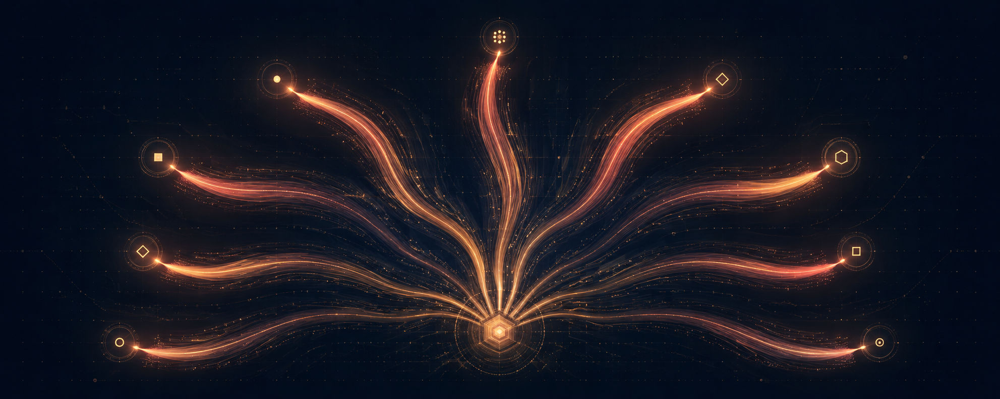

<p align="center">
  
</p>

# nine-tails

[](https://github.com/scottmeyer/nine-tails/actions/workflows/ci.yml)
[](https://github.com/scottmeyer/nine-tails/releases/latest)
[](go.mod)
[](LICENSE)

Persistent, inspectable context for coding agents—without becoming an agent
framework.

`nine-tails` is a small CLI sidecar that resolves a named agent into a Markdown
context capsule. As the agent works, it can record corrections, useful
experience, working state, executable tools, and future signals. The next
invocation starts better informed.

It is deliberately harness-independent. It does not run an agent loop, choose
a model, proxy prompts, or require a daemon or network service.

```text
base + compiled brief + recent adjustments + state + due signals
                              │
                       nine-tails load
                              ▼
                    context capsule + receipt
                              │
                         agent session
                              ▼
              corrections, state, tools, and signals
```

## Why nine-tails?

Agent instruction files are good at stable project rules, but poor at carrying
what an agent learned yesterday. Transcripts contain that history, but they are
large, opaque, and tied to a harness. `nine-tails` keeps the durable parts in a
small local store with a plain-text interface an agent can inspect and repair.

- **Context capsules:** load only the definition, brief, adjustments, state,
  tools, and signals relevant to this invocation.
- **Corrections that take effect immediately:** append a preference or warning
  now; it appears on the next load without waiting for compilation.
- **Bounded working state:** update small YAML documents with compare-and-swap
  protection.
- **Selective memory:** keep durable facts, reminders, and executable
  capabilities without saving every turn or raw tool output.
- **Inspectable history:** records are immutable and exportable; superseded
  versions remain available for diagnosis and repair.
- **Portable integration:** use the CLI from any harness, or opt into the
  included Claude Code and Codex lifecycle adapters.

## Install

After the first signed release, install with Homebrew on macOS or Linux:

```sh
brew install --cask scottmeyer/tap/nine-tails
```

Download an archive for macOS, Linux, or Windows from
[GitHub Releases](https://github.com/scottmeyer/nine-tails/releases/latest), or
install from source with Go 1.26 or newer:

```sh
go install github.com/scottmeyer/nine-tails/cmd/nine-tails@latest
```

From a checkout:

```sh
make build      # writes ./bin/nine-tails
make install    # writes $(go env GOPATH)/bin/nine-tails
```

## Quick start

Start with `pilot`, the built-in usage guide and agent catalog:

```sh
nine-tails load pilot \
  --task "Help me add authentication" \
  --meta repo-id=my-project \
  --meta harness=my-harness
```

On a fresh store, that command seeds `pilot` and `reflector` from documents
embedded in the binary. The returned Markdown contains a receipt such as
`[nine-tails-context=ctx_2]`; keep that ID for writes made during the episode.

Create a specialized agent with a base definition:

```sh
nine-tails base pr-review --meta title="PR Review Agent" --stdin <<'EOF'
## Purpose

Review proposed changes for demonstrable correctness and regression risks.
EOF

nine-tails load pr-review \
  --task "Review PR 1842" \
  --meta repo-id=my-project
```

Teach it while it works:

```sh
nine-tails prefer --context ctx_2 \
  "Lead with concrete evidence; keep prose concise."

nine-tails avoid --context ctx_2 --meta repo-id=my-project \
  "Editing generated mocks."
```

The next `load` includes those adjustments. Pass metadata on a write only when
the knowledge should be scoped by that metadata; otherwise it remains useful
wherever the agent runs.

## What should be persisted?

| Need | Command | Result |
| --- | --- | --- |
| Operating guidance | `note`, `prefer`, `avoid` | Appears in recent adjustments and can later be compiled |
| A fact worth retrieving later | `remember` | Stays in the recall lane and is searchable with `inspect --query` |
| Small current working state | `state put` | Replaces a named YAML state using compare-and-swap |
| A reminder or external event | `signal` | Appears when due and can be leased by a scheduler |
| A reusable executable capability | `tool add` | Adds a validated named tool callable through a context |
| A durable shorter brief | `compile` | Condenses eligible journal records through a configured model command |

Examples:

```sh
# Compare-and-swap working state.
nine-tails state put pr-review/working --expect none --stdin <<'EOF'
status: waiting
waiting-on: ci
next-action: recheck the goroutine finding
EOF

# Schedule work without running a scheduler inside nine-tails.
nine-tails signal pr-review --at +2h \
  --subject "Recheck PR 1842 after CI" \
  --dedupe-key my-project:pr-1842:recheck-ci
nine-tails tick --claim --lease 5m

# Register a script as a named tool, then call it through a loaded context.
nine-tails tool add pr-review complete-pr-diff \
  --script ./complete-pr-diff.sh \
  --description "Fetch complete changed-file contents for a pull request"
nine-tails call --context ctx_2 complete-pr-diff --input '{"pr": 1842}'
```

Use `inspect` as the repair surface:

```sh
nine-tails inspect pr-review --include base,brief,journal
nine-tails inspect ctx_2
nine-tails inspect pr-review --lane recall --query "generated mocks"
```

Every mutation prints its new ID on stdout. Add `--format json` for a complete
record envelope. Diagnostics go to stderr; commands are non-interactive and
never emit color.

## Agent-harness integration

The portable integration is one instruction in `AGENTS.md`, `CLAUDE.md`, or the
equivalent file for a harness:

```md
Start with `nine-tails load pilot --task "<task>" --meta repo-id=<repo> --meta harness=<harness>` and follow its capsule.
```

Claude Code and Codex can also receive capsules through opt-in lifecycle
adapters:

```sh
# Install the merge-preserving adapter once.
nine-tails hooks install --claude
nine-tails hooks install --codex

# Explicitly activate it for one harness process tree.
nine-tails hooks run pr-review --meta repo-id=my-project --claude
nine-tails hooks run pr-review --meta repo-id=my-project --codex -- --model MODEL

# Remove only entries owned by nine-tails.
nine-tails hooks uninstall --claude
nine-tails hooks uninstall --codex
```

Installation alone does not make ordinary sessions use `nine-tails`. The hook
gate stays silent and does not open the store unless the session inherits a
live capability created by `hooks run`. Codex asks the user to review newly
installed hooks in `/hooks` before trusting them.

The adapters inject a fresh capsule at the first real prompt, replay the same
capsule after compaction, and create a new parent-linked receipt after a clear.
They do not read transcripts or trigger unconditional reflection. Exact
lifecycle, size-limit, process, and platform behavior is pinned in
[DESIGN.md](DESIGN.md#15-harness-adapters-spec-172).

## Storage and scope

By default, data lives under `~/.nine-tails`:

```text
~/.nine-tails/
├── nine-tails.db
├── artifacts/
├── exports/
├── runtime/
└── config.yaml       # optional
```

Set `NINE_TAILS_HOME` to move it. There is one store per user—not one store per
repository or worktree. A repository is ambient metadata supplied on load:

```sh
nine-tails load builder \
  --task "Implement the auth endpoint" \
  --meta repo-id=my-project \
  --meta track=auth
```

The long-lived agent is `builder`; this particular invocation is its context
receipt. Two concurrent builders remain one agent so their learnings can roll
up together, while `repo-id`, `track`, or other invocation metadata can target
relevant context and signals. Do not encode sessions in names such as
`builder@session`.

To move an agent to another machine or share it with someone else, use
`export --bundle` and `import`. No repository-aware synchronization is hidden
inside the binary.

## Compiling the journal

Recent adjustments remain visible immediately. When they grow large,
`compile` can turn them into a durable brief through any command that reads the
compile document on stdin and writes the result on stdout:

```yaml
# ~/.nine-tails/config.yaml
compiler:
  argv: ["claude", "-p", "--output-format", "text"]
  timeout: 300s
```

```sh
nine-tails compile pr-review
```

For a manual or custom-model workflow, use `compile-input` followed by
`brief put`. Compiler output is validated for complete dispositions and
installed with compare-and-swap protection.

## Project status and development

`nine-tails` currently implements the v0.3 sidecar specification. The
behavioral contract is [lore-sidecar-spec-v0.3.md](lore-sidecar-spec-v0.3.md),
and implementation decisions are binding in [DESIGN.md](DESIGN.md).

```sh
make test
make vet
make build
```

Tests use isolated temporary homes and never touch `~/.nine-tails`.

The release workflow publishes checksummed binaries for supported platforms
when a semantic `v*.*.*` tag is pushed. macOS executables are Developer ID
signed and notarized before publication. Maintainer setup and signing details
live in [`docs/releasing.md`](docs/releasing.md).

## License

MIT © 2026 Scott Meyer. See [LICENSE](LICENSE).
